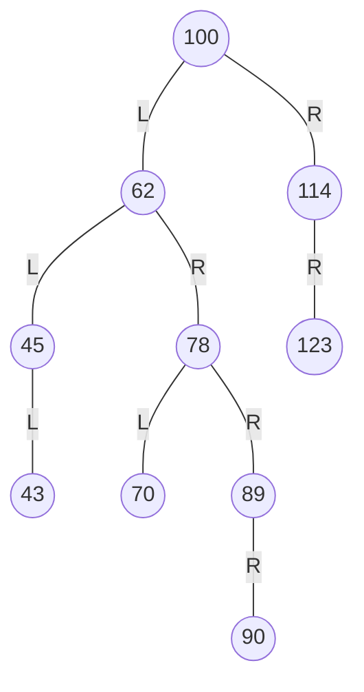

```mermaid
graph TD
A((100))--L---B((62))
A((100))--R---C((114))
B((62))--L---D((45))
D((45))--L---H((43))
B((62))--R---E((78))
E((78))--L---J((70))
E((78))--R---F((89))
F((89))--R---G((90))
C((114))--R---I((123))
```